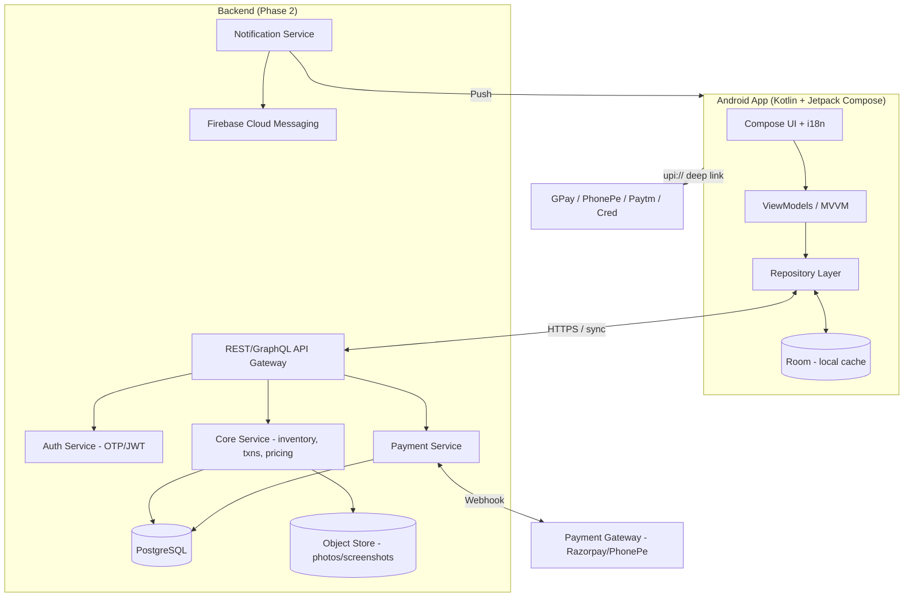

# TENCO — High-Level Design Document

**TENCO** = **TEN**der **CO**conut supply-chain platform.
A mobile-first application connecting **Suppliers** and **Local Vendors** in the tender-coconut
trade, with localized (multi-language) UX and UPI payment support.

- **Status:** Draft v0.1
- **Last updated:** 2026-07-18
- **Owner:** igkrish

---

## 1. Overview

TENCO digitizes the flow of tender coconuts from **dealers** (source markets like Pollachi,
Nellore, Theni) → **Suppliers** (who buy in bulk) → **Local Vendors** (who sell to end
customers). It tracks inventory, pricing, transactions, complaints/losses, and payments
(primarily via UPI).

The Vendor experience is optimized for **low-literacy, mobile-first** users: visual dashboards,
one-tap actions, local-language toggle, and voice prompts.

### 1.1 Goals
- Single source of truth for stock, transactions, dues, and payments between suppliers & vendors.
- Frictionless UPI payments (full or partial) with reliable status tracking.
- Localized, accessible UX (Tamil, Telugu, Hindi, English).
- Accurate profit/loss reporting for suppliers, including complaint-driven price adjustments.

### 1.2 Non-Goals (for now)
- End-customer (retail buyer) app.
- Logistics/route optimization or GPS tracking.
- Accounting/GST filing integration.
- Web storefront / e-commerce.

### 1.3 Key Constraints & Realities
- **UPI callback limitation:** Plain `upi://pay` deep links open a UPI app but do **not**
  reliably return a success/failure result to the calling app on Android. **Automatic**
  confirmation requires a **payment gateway (PG) business account** (Razorpay / PhonePe for
  Business / Cashfree) with server-side webhooks. Design supports both: PG (auto) with a
  **manual/screenshot fallback**.
- **Real-time cross-device sync** (supplier phone ↔ vendor phone) requires a **backend**.
  A local-only build works for a single device / demo only.

---

## 2. Personas & Roles

| Role | Description | Primary device | Literacy assumption |
|------|-------------|----------------|---------------------|
| **Supplier** | Buys from dealers, distributes to vendors, manages pricing, tracks P&L | Phone/tablet | Medium–high |
| **Local Vendor** | Receives stock, sells locally, pays supplier | Phone | Low — visual UX |
| **Admin** (internal) | Manages master data, disputes, onboarding | Web/console | High |

**Access model:** role-based (RBAC). A user account maps to exactly one active role; suppliers
own a set of vendors they transact with.

---

## 3. High-Level Architecture



**Pattern:** Offline-first mobile client (Room as local cache/source of truth) that syncs with a
backend. UI never blocks on network; writes are queued and reconciled.

---

## 4. Frontend Design (Android)

### 4.1 Tech Stack (finalized)

Kotlin end-to-end (shared language/models with backend). Versions are the P1 baseline.

| Concern | Choice | Version (P1 baseline) |
|---------|--------|-----------------------|
| Language | **Kotlin** (K2 compiler) | 2.0.21 |
| Build | **Gradle (Kotlin DSL) + Version Catalog** | Gradle 8.11.x |
| Android Gradle Plugin | **AGP** | 8.7.x |
| compileSdk / targetSdk | **35** (Android 15) | — |
| minSdk | **26** (Android 8.0) | — |
| UI | **Jetpack Compose + Material 3** | Compose BOM 2024.12.x |
| Architecture | **MVVM + MVI-style UDF** (immutable UI state ← ViewModel) | — |
| DI | **Hilt** | 2.52 |
| Local DB | **Room** (offline-first cache + write queue) via **KSP** | Room 2.6.1 / KSP 2.0.21-1.0.28 |
| Async | **Coroutines + Flow** | 1.9.x |
| Navigation | **Navigation-Compose** (type-safe) | 2.8.x |
| Prefs | **DataStore** (language + session) | 1.1.x |
| Images | **Coil** (complaint photos) | 2.7.x |
| Networking (P2) | **Ktor Client** + **kotlinx.serialization** | Ktor 3.x |
| Background sync (P2) | **WorkManager** | 2.10.x |
| i18n | Per-locale `strings.xml` + in-app **per-app locale** override | — |
| Accessibility/Voice | TalkBack, large tap targets, high contrast, optional **TextToSpeech** | — |

> **P1 note:** local-only, so networking (Ktor) and WorkManager sync are deferred to P2 to keep
> the MVP lean. Code is structured (repository interfaces) so a remote data source drops in later.
> **KMP path:** Room, Coil, Ktor, DataStore are all KMP-ready — adopt Compose Multiplatform if
> iOS is ever required (~80% shared code).

### 4.2 Module / Package Structure
```
com.tenco
├── core            # common utils, theme, i18n, result types
├── data            # Room entities, DAOs, repositories, remote DTOs, sync
├── domain          # models + use cases (role-agnostic business logic)
├── feature
│   ├── auth        # phone/OTP login, role selection
│   ├── supplier    # dashboard, dealers, vendors, pricing, txns, reports, complaints
│   ├── vendor      # dashboard, delivery confirm, complaints, pay, history
│   └── payment     # UPI deep-link, PG flow, status tracking, fallback
└── app             # navigation graph, DI wiring, entry point
```

### 4.3 Navigation Map
```
Splash → Language Select (first run) → Login (Phone + OTP) → Role Router
   ├── Supplier
   │     Dashboard ├─ Dealers ├─ Vendors ├─ Pricing
   │               ├─ Transactions ├─ Reports (P&L) ├─ Complaints
   └── Vendor
         Dashboard ├─ Order Summary ├─ Confirm Delivery
                   ├─ Pay (UPI) ├─ Complaints ├─ History ├─ Contact Supplier
```

### 4.4 Key Screens

**Supplier**
- **Dashboard:** stock on hand, vendor-wise distribution, total earnings, dues owed to supplier,
  losses from price adjustments; quick filters (day/week/month).
- **Dealer Management:** add/edit dealers & purchases by location (Pollachi/Nellore/Theni),
  quantity, cost.
- **Vendor Management:** vendor list, per-vendor dues, price overrides.
- **Pricing:** vendor-specific price list, effective dates, adjustment history.
- **Transactions:** received (from dealers) + supplied (to vendors) + payments ledger.
- **Reports (P&L):** Revenue − Purchase Cost − Price Adjustments − Complaint losses; monthly &
  filtered; export CSV.
- **Complaints:** review vendor complaints, apply price adjustment → auto-logs loss.

**Vendor (visual, low-literacy)**
- **Dashboard:** big cards — "Received 50 @ ₹28", "Pending ₹1,200"; color-coded.
- **One-tap Delivery Confirmation.**
- **Raise Complaint:** reason chips + optional photo (Coil/camera).
- **Pay Now:** enter any amount (full/partial) → launch UPI app via deep link → record result
  (auto via PG, else manual/screenshot). Shows remaining dues.
- **History:** color-coded statuses (pending/completed/failed).
- **Contact Supplier:** WhatsApp / call intent buttons.
- **Language Toggle** + optional voice prompts.

### 4.5 Localization Strategy
- All user-facing strings in `res/values-<lang>/strings.xml` (`ta`, `te`, `hi`, default `en`).
- In-app language override persisted (DataStore) + `AppCompatDelegate` / per-app locale
  (`LocaleManager`), independent of system locale.
- Numbers/currency via `NumberFormat` with `en-IN` (₹) formatting.
- Icons + color + short text to support low-literacy users; optional TTS for key labels/amounts.

### 4.6 Offline-First Behavior
- Room is the UI's source of truth. Reads come from Room; the sync layer refreshes it.
- Writes go to Room immediately and enqueue an outbox record; a `WorkManager` sync worker pushes
  to backend when online, with conflict resolution (last-write-wins on scalar fields +
  server-authoritative on money/ledger).

---

## 5. Backend Design (Phase 2)

> Phase 1 ships local-only. This section defines the target backend so the client is built
> sync-ready from day one.

### 5.1 Tech Stack (finalized)

| Concern | Choice | Notes |
|---------|--------|-------|
| Runtime/Framework | **Kotlin + Spring Boot 3.x on JDK 21** (virtual threads) | Matches local Corretto 21; high throughput without reactive complexity; shares Kotlin data classes with the app. |
| API | **REST + OpenAPI** (JSON), kotlinx.serialization | Simple, tooling-rich, easy mobile codegen. |
| DB | **PostgreSQL 16/17** | Transactional, append-only money ledger. |
| Migrations | **Flyway** | Versioned schema changes. |
| Cache / rate-limit | **Redis** (ElastiCache) | OTP throttling, hot dashboard data. |
| Object storage | **Amazon S3** | Complaint photos + UPI screenshots via signed URLs. |
| Auth | **Phone OTP → JWT** (access+refresh); SMS via **MSG91** (India) or Twilio | Managed alt: AWS Cognito. |
| Push | **Firebase Cloud Messaging (FCM)** | Standard Android push. |
| Compute / Hosting | **AWS ECS Fargate** (containers) | Serverless containers; RDS Postgres, ElastiCache Redis. |
| IaC | **AWS CDK (TypeScript)** | Type-safe infra. Alt: Terraform. |
| CI/CD | **GitHub Actions** | Build/test/deploy app + backend. |
| Observability | **OpenTelemetry → CloudWatch / Grafana** | Traces, metrics, logs. |

### 5.2 Services
| Service | Responsibility |
|---------|----------------|
| **Auth** | OTP issue/verify, JWT, device registration |
| **Core** | Dealers, inventory, vendors, pricing, transactions, complaints, reports |
| **Payment** | Payment intents, UPI/PG orchestration, webhook ingestion, reconciliation |
| **Notification** | FCM push (payment confirmed, new delivery, complaint update) |
| **Sync** | Delta sync endpoints (pull changes since cursor, push outbox) |

### 5.3 Representative API (REST)
```
POST /auth/otp/request           { phone }
POST /auth/otp/verify            { phone, code } → { accessToken, refreshToken, role }

GET  /suppliers/me/dashboard
GET  /dealers        POST /dealers        PUT /dealers/{id}
POST /purchases                            # dealer → supplier stock in
GET  /vendors        POST /vendors
GET  /prices?vendorId=            PUT /prices
POST /deliveries                           # supplier → vendor (stock out)
POST /deliveries/{id}/confirm              # vendor one-tap confirm
GET  /transactions?from=&to=&vendorId=
POST /complaints     (multipart: reason, photo)
PUT  /complaints/{id}/resolve              # supplier price adjustment → loss log
GET  /reports/pnl?month=

POST /payments/intent            { vendorId, amount } → { intentId, upiDeepLink, qr }
POST /payments/{id}/manual-proof (multipart: screenshot)   # fallback
POST /webhooks/pg                # gateway → us (server-to-server)
GET  /payments?status=

GET  /sync/changes?since=<cursor>
POST /sync/outbox                # batched client writes
```

### 5.4 Auth & RBAC
- Phone/OTP login → JWT with `role` and `userId` claims.
- Authorization enforced per endpoint; suppliers scoped to their own vendors; vendors scoped to
  their own transactions.

---

## 6. Data Model (ER)

```mermaid
erDiagram
    USER ||--o{ SUPPLIER : is
    USER ||--o{ VENDOR : is
    SUPPLIER ||--o{ DEALER_PURCHASE : records
    DEALER ||--o{ DEALER_PURCHASE : source
    SUPPLIER ||--o{ VENDOR_LINK : manages
    VENDOR ||--o{ VENDOR_LINK : linkedTo
    SUPPLIER ||--o{ PRICE : sets
    VENDOR ||--o{ PRICE : receives
    SUPPLIER ||--o{ DELIVERY : ships
    VENDOR ||--o{ DELIVERY : receives
    DELIVERY ||--o{ COMPLAINT : mayHave
    VENDOR ||--o{ PAYMENT : makes
    SUPPLIER ||--o{ PAYMENT : receives
    DELIVERY ||--o{ TRANSACTION : generates
    PAYMENT ||--o{ TRANSACTION : generates

    USER { string id PK; string phone; string name; string role; string language }
    DEALER { string id PK; string name; string location }
    DEALER_PURCHASE { string id PK; string dealerId FK; string supplierId FK; int qty; money unitCost; date date }
    VENDOR_LINK { string id PK; string supplierId FK; string vendorId FK }
    PRICE { string id PK; string supplierId FK; string vendorId FK; money unitPrice; date effectiveFrom }
    DELIVERY { string id PK; string supplierId FK; string vendorId FK; int qty; money unitPrice; string status; datetime createdAt; datetime confirmedAt }
    COMPLAINT { string id PK; string deliveryId FK; string reason; string photoUrl; money adjustmentAmount; string status }
    PAYMENT { string id PK; string vendorId FK; string supplierId FK; money amount; string method; string status; string upiRef; string proofUrl; datetime createdAt }
    TRANSACTION { string id PK; string type; string refId; money amount; datetime createdAt }
    OUTBOX { string id PK; string entity; string op; json payload; string syncState }
```

**Money handling:** store as integer minor units (paise) to avoid float errors; format at UI.
**Ledger:** `TRANSACTION` is append-only; balances/dues are derived (or materialized) — never
edited in place.

---

## 7. UPI Payment Design

### 7.1 Flow A — Deep Link (Phase 1, no backend)
```
Vendor enters amount → build upi://pay?pa=<vpa>&pn=<name>&am=<amt>&cu=INR&tn=<note>
→ Android chooser opens GPay/PhonePe/Paytm/Cred → user pays
→ (No reliable callback) → app shows "Did the payment succeed?" → vendor confirms
→ optional: upload screenshot as proof → PAYMENT saved (status = pending_verification)
```

### 7.2 Flow B — Payment Gateway (Phase 2, auto)

**Chosen gateway: Razorpay** (best-in-class UPI, reliable signed webhooks, easy partial payments;
alternatives: Cashfree, PhonePe for Business).
```
App → POST /payments/intent → backend creates PG order → returns intent + UPI link/QR
→ Vendor pays in UPI app → PG → POST /webhooks/pg (server-to-server, signed)
→ backend verifies signature → marks PAYMENT completed/failed
→ push (FCM) to vendor + supplier → dues auto-update in real time
```

### 7.3 Status Model
`PENDING → PENDING_VERIFICATION → COMPLETED | FAILED` (+ `REFUNDED` for PG).
Color coding: amber = pending, green = completed, red = failed.

### 7.4 Reconciliation & Fallback
- PG webhook is source of truth when available.
- Manual/screenshot proofs go to a supplier review queue; supplier confirms → COMPLETED.
- Idempotency keys on intents/webhooks to avoid double-posting.

---

## 8. Notifications
- **FCM** push for: payment confirmed/failed, new delivery to confirm, complaint resolved,
  dues reminder.
- In-app inbox mirrors pushes; deep-links into the relevant screen.

## 9. Security & Privacy
- HTTPS/TLS everywhere; certificate pinning on mobile.
- JWT (short-lived access + refresh); tokens in Android Keystore-backed encrypted storage.
- OTP rate-limiting & lockout; PG **webhook signature verification** (never trust client for
  payment success).
- Least-privilege RBAC; suppliers/vendors see only their own data.
- PII (phone, names) encrypted at rest; photos/screenshots in private object store with signed
  URLs.
- No secrets in the app binary; VPAs and keys served/configured server-side in Phase 2.

## 10. Non-Functional Requirements
- **Offline-first:** full read + queued write with poor connectivity.
- **Performance:** dashboard cold load < 2s from local cache.
- **Scale (initial):** hundreds of suppliers, thousands of vendors.
- **Reliability:** append-only ledger; money never lost on sync conflict.
- **Accessibility:** TalkBack, large tap targets, high contrast, optional TTS.

---

## 11. Phased Roadmap

| Phase | Scope | Backend? | Payments |
|-------|-------|----------|----------|
| **P1 — Local MVP** | Compose app, Room, both dashboards, dealer/vendor/txn/pricing/complaint mgmt, i18n (EN/TA/TE/HI), reports, seed data | No (local only) | UPI deep link + manual/screenshot |
| **P2 — Backend + Sync** | Auth (OTP/JWT), REST API, Postgres, delta sync, RBAC | Yes | — |
| **P3 — Auto Payments** | PG integration (Razorpay/PhonePe), webhooks, FCM push, reconciliation | Yes | Auto-confirm |
| **P4 — Polish** | Voice prompts, advanced reports/export, dispute workflows, analytics | Yes | — |

## 12. Open Questions
1. Backend language preference — **Kotlin/Spring** vs **Node/NestJS**?
2. Which PG business account is available — **Razorpay**, **PhonePe for Business**, or **Cashfree**?
3. Is there an existing user base / phone-number auth provider (SMS gateway)?
4. Single supplier ↔ many vendors, or many suppliers in one deployment (multi-tenant)?
5. Do vendors always pay one known supplier VPA, or dynamic per transaction?

---

## 13. Immediate Next Step
Build **Phase 1 (Local MVP)**: scaffold the Kotlin + Compose project, set up Room + navigation +
role router + i18n, and implement the Supplier and Vendor dashboards with seed data, then iterate
feature-by-feature.
